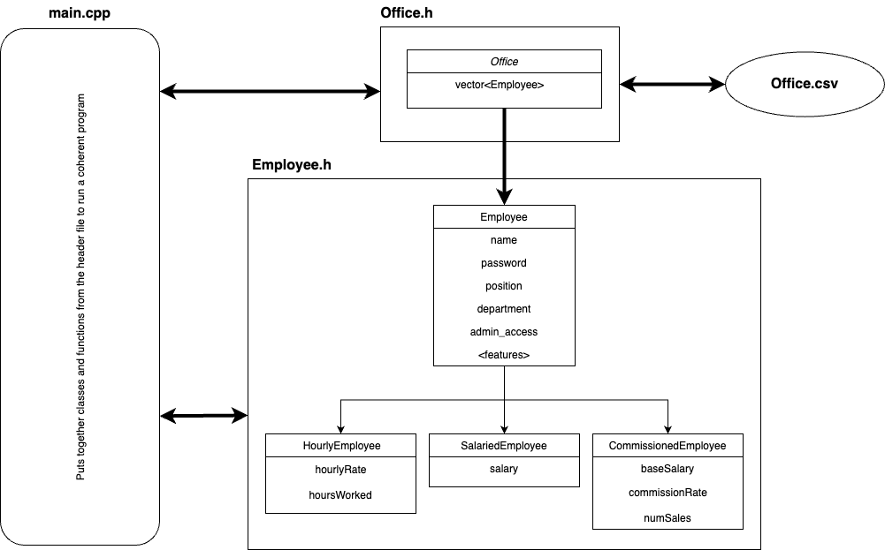
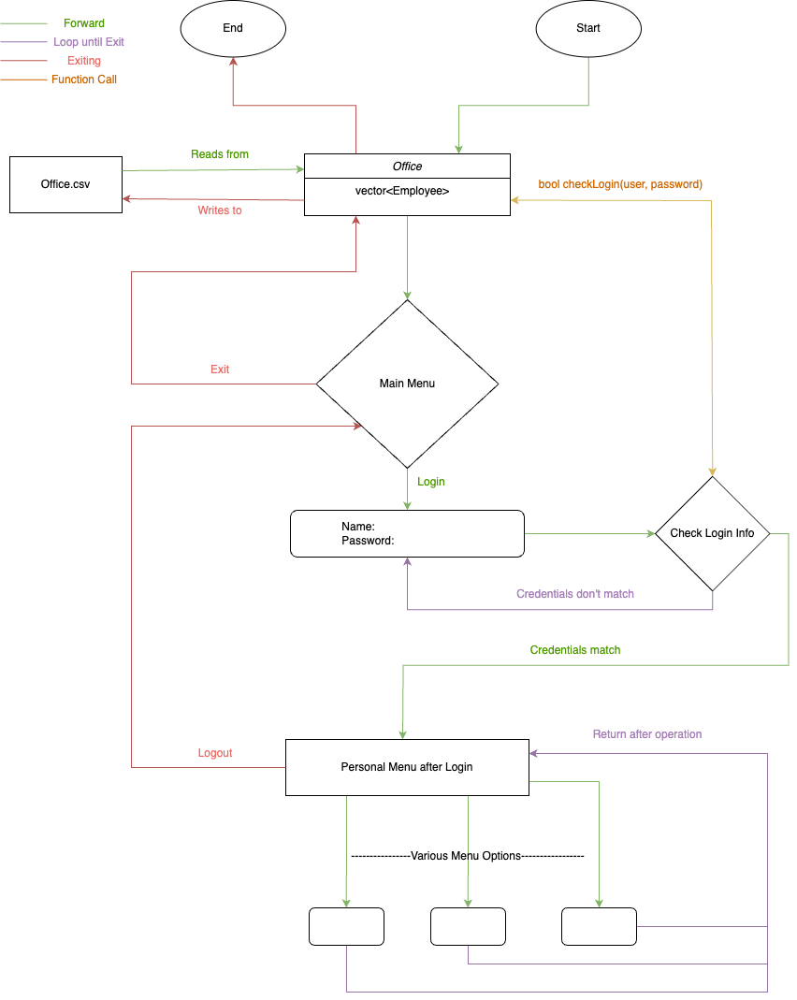
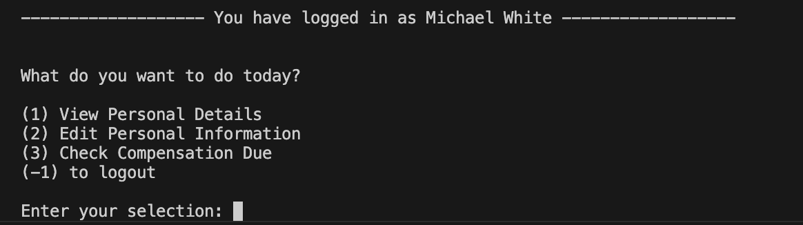
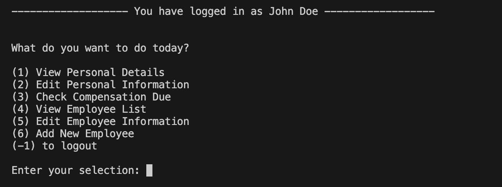

<h1 align = "center"> Employee Management System </h1>
<h4 align = "center">OOP Project Fall 2024 - Udgam Bhattarai (ub2028) </h4>


## Introduction
Employees are the biggest assets for any company, and managing them effectively is crucial for their success. This involves making employee information organized, accessible, and up-to-date and enhancing the interaction between the employees and employers. An Employee Management Software (EMS) is an array of tools and methods that helps facilitate said employee management process. An EMS is an array of tools and methods designed to streamline the HR process by making the recording, accessing and altering of employee information more accessible and convenient, for both employers and employees. In addition to bettering the overall interaction between the employees and the employers, an EMS also improves consistency and accuracy and thus fosters a more efficient HR process, stronger employee engagement, and better overall company performance.

In today’s market, there are various employee management softwares such as BambooHR, UltiPro, and Gusto, that offer a wide range of different tools and services catered to employers in specific industries with specific demands, while sharing the same fundamental offerings such as employee data storage and manipulation, payroll management, and employee self-service. To that end, this project aims to emulate some of these basic EMS functionalities and create a solid foundation for further implementation of more specific services and tools. 

## Approach
The goal of this project was to create the basic framework of an Employee Management System (EMS) such that it performed the most elementary functions and services but also provided a flexible and versatile code base that would make the implementation of other more specific functionalities easier. To that end, the key areas that this EMS aims to address can be summarized as follows:

1.  __Employee Information Management:__
By maintaining comprehensive employee records, such as personal details, job titles, work history, performance data, and other relevant information, the EMS aims to not just help any organization keep track of its employees, but it also allows easy access and update of these records, ensuring that they are accurate and up-to-date. Additionally, this feature also allows the organization to use such records and metrics for important decision-making processes such as promotions, payroll processing and managing benefits.

2. __Employee Self-Service:__
By expanding on the services from (1), this EMS aims to integrate features that allow employees to view and manage their own information, such as personal details, hourly rate, compensation due, etc. Employees can log their hours, and sales, and update their personal information whenever necessary, reducing the administrative burden on HR and empowering employees with more control over their records.

3.  __Payroll Processing:__
This EMS also tracks employee payrolls by identifying the type of employment, and using the recorded data and metrics to accurately calculate the compensation that the employees are entitled to. This automation helps ensure that the calculations are accurate and update consistently based on the required metrics. This feature simplifies payroll processing, reducing errors and ensuring timely payments.

However, it was important to introduce some constraints in the designing of this Employee Management System in order to avoid ambiguity and help emulate its integration with a real-life organizational environment. To that end, the limitations of this approach towards an EMS are:

1. __Types of Employees:__
    This EMS only works with three different types of employees (_Salaried, Hourly, and Commissioned_), that are differentiated by the way their payroll is processed and the metrics that are thus used to make said processing.

2. __Employee Information:__
    This implementation of an EMS only works with a limited amount of only fundamental information about the employees (i.e. name, department, position) that can be manipulated and edited.

That being said, the code is still very scalable and utilizes Object-Oriented Programming concepts such the implementation of newer elements and added complexity should be feasible, and even relatively easier. 

## Solution
This Employee Management Software consists of two header files, one C++ file and CSV file: 
1. ___Office.h___ contains all the definitions and functions for the```Office``` class that is used to store the data of all the employees in the office, and operate on them accordingly.
2. ___Employees.h___ contains the definitions and functions for the overarching ```Employee``` class and the derived classes – ```SalariedEmployee```, ```HourlyEmployee```, and ```CommissionedEmployee``` which is used to handle specific types of employees.
3. ___main.cpp___ is the framework that puts all of these elements together, and provides an interface for the user to interact with the EMS and perform tasks accordingly.
4. ___Office.csv___ stores all data about the employees, and is read into the system at startup and rewritten when the program shuts down, reflecting all the changes and edits made in the program. 

### Code
The overarching technical structure of the Employee Management System can be describes as follows:



#### Office.csv

The data for the employees in the office is saved in a .csv file. This will largely determine a lot of how the data in handled and processed, especially when reading from and writing back to the file.

```csv
name,password,position,admin_access,department,type,salary,hourly_rate,hours_worked,base_salary,commission_rate,num_sales
John Doe,password123,Manager,1,Sales,Salaried,75000,,,,,
Jane Smith,password456,Salesperson,0,Sales,Commissioned,,,,40000,70.5,778
Bob Johnson,password789,Clerk,0,Admin,Hourly,,20,80,,,
Alice Brown,password101,Senior Developer,1,IT,Salaried,90000,,,,,
```
#### Employee.h

The Employee.h file consists of class definitions and functions definitions for the primary ```Employee``` class and its three derived classes:
 
```cpp
class Employee{...}
class HourlyEmployee : public Employee{...}
class SalariedEmployee: public Employee{...}
class CommissionedEmployee : public Employee{...}
```

In the definition of the root class, the class ```Office``` is declared as a friend class to ```Employee```. This is because when operating on the list of all employees in Office (such as printing to console, or editing the file), there often arises a need for the class to access private or protected variables in the ```Employee``` class. 

```cpp
friend class Office;
```
Since the EMS implementation mostly works with pointers to the ```Employee``` class that refer to its various derived class objects, most of the functions in the root class are defined as virtual, given that there is a need for said functions to be overridden by operations specific to the type of employee at runtime. 

```cpp
class Employee{
	// purely virtual function
virtual double calculatePay() const = 0;

// other virtual functions
void virtual editPersonalInfo(int selection, bool admin_access) {...}
virtual void viewInfo() {...}
}

class SalariedEmployee: public Employee{
	// virtual function redefined in the derived class
	double calculatePay(){
		return salary;
	}
}
```

Likewise, functions that were intended to just print to the console or write information to file were thus declared as constant functions in order to avoid them altering the values in the class.

```cpp
void virtual printInfo() const{...}
void virtual writeToCSV(ofstream &outfile) const {...}
```
Similarly, some overriden virtual functions in the derived classes call the function from the parent class before executing additional operations in order to avoid redundancy and simplify the implementation.

```cpp
class CommissionedEmployee: public Employee{
        // overriding the viewInfo() from the parent class
        void viewInfo()   {
           
            // calling the function from the parent class to write the basic shared information
            Employee::viewInfo();  
            
            cout << "Base Salary: " << baseSalary << endl;
            cout << "Commission Rate: " << commissionRate << endl;
            cout << "Number of Sales: " << numSales << endl;
        }
}
```
In addition, the login process for the EMS involves checking if the both the User and Password input by the user match any Employee in the Office. This involves individually comparing the user input with the ```name``` of each ```Employee``` and then comparing their ```password```. However, to simplify this process, the code overloads the ```==``` operator for the ```Employee``` class such that the user inputs are made into a pair and when equated with an ```Employee``` object, returns true or false based on whether or not the input name and password match that of the user.

```cpp
class Employee{
	// overloaded operator
	 bool operator==(const pair<string, string>& credentials) const {
        return (this->name == credentials.first && this->password == credentials.second);
    }
};
```
In conclusion, Employee.h provides a versatile framework for managing different types of employees, including hourly, salaried, and commissioned employees. With its flexible class structure, the system allows for easy extension and customization of employee data, payroll calculations, and administrative functions. This design promotes scalability while maintaining the core functionalities essential to efficient employee management.

#### Office.h

The Office.h file consists of class definitions and functions definitions for the ```Office``` class that stores data about all the employees and performs large-scale operations on it. It works extensively with vectors and files to read, store and write information about employees at the office. To that end, various STLs are imported to the header file in order to facilitate this process.
```cpp
#include <string>
#include <vector>
#include <fstream>
#include <sstream>
```
Likewise, it also integrates elements from the previously defined Employee.h header file such that there arises a need for the file to be imported to the code base too.

```cpp
#include "Employees.h"
```
Since the Office class will be reading data from the file as strings using the filestream, the data needs to be converted to the different types (integer, double, etc) as per necessity, there arises a need for various functions to perform said task effectively – C++ already offers a wide variety of functions that help facilitate the task. However, there is no function that undertakes direct string-to-boolean conversion for the admin-access variable in the .csv file. To that end, an inline function is defined to make this process more efficient at compilation.

```cpp
inline bool stringToBool(const string& str) {
    return (str == "1");
}
```
Moving onto the definition of the Office class, it includes a private vector variable that stores pointers to Employee objects. This is essentially, what stores the list of all the employees in the organization, as read from the data file.

```cpp
class Office{
    private:
        vector<Employee*> employeeList; // list of all the employees from the file
};
```
Then, when the constructor for the class Office is called with the parameter filename, it makes use of filestream, stringstream and vector functions to read data from the file and add it to a vector of Employee pointers with the data from the file. 

```cpp
class Office{
    public:
    Office(string filename_in){
        // using fstream
        filename = filename_in;
        ifstream istream;
        istream.open(filename);
        
        // using sstream
        getline(ss, name, ',');
        getline(ss, password, ',');
        getline(ss, position, ',');
        getline(ss, admin_access, ',');
        getline(ss, department, ',');
        getline(ss, type, ',');

  
        if (type == "Salaried"){
            string salary;
            getline(ss, salary, ',');
            // using vector function
            employeeList.push_back(new SalariedEmployee(name, password, position, department, stod(salary), stringToBool(admin_access)));
        }
        istream.close();
    }
};
```
Likewise, the Office class also has other functions that work with classes and pointers and even return them.
```cpp
class Office{ 
	public:
    Employee* login(string user, string password){...}
    Employee* findEmployee(string name){...}
}
```
To that end, the Office class efficiently manages employee data by reading from a file, enabling operations like adding, finding, and filtering employees based on various criteria. It supports the recording and tracking of all the employees and securely handles other vital functionalities such as login, and reading from and writing to files. 

Thus, in order to record the changes made to employee records throughout the duration of the program, the .csv file needed to be updated to reflect these changes. This is achieved using the destructor for the Office class, which is called at the end of the program, such that all the changes made throughout the program are recorded in the .csv file before it is closed.

```cpp
class Office{
	public:
    // Destructor
	~Office(){
        // Performs functions additional to just deleting the pointer
	    ofstream ofile;
	    ofile.open("temp.csv");
	    ofile << header << end
        for (Employee* employee : employeeList) {
            employee->writeToCSV(ofile);
        }
        ofile.close();
    }
}
```

#### main.cpp

This file serves as the center of the system, bringing all the header files together to put together a functional program as follows:



Upon startup, an ```Office``` object is declared with the parameter ```filename``` which is the path to the .csv file that stores the data of all the employees. Once the data has been loaded into the Office object as a vector of Employee pointers ```Employee*``` – each referencing their specific derived class of Employee, based on their type of employment. 

```cpp
Office* office = new Office("Office.csv");
```
Then, the user is prompted to log into the system using their name, and unique password as stored in the file.

```cpp
cout << endl <<  "User Name: ";
getline(cin, userName);
cout << "Password: ";
cin >> password;
loggedEmployee = office->login(userName, password);
```
Once logged in, a menu is displayed to the user. 



The options offered to the user depends on whether the user has admin access or not, with admins having permissions to access and edit records for all the employees, while non-admins can only view and manipulate their personal records. 



Based on the user selection, the main.cpp file executes commands accordingly to meet the needs of the user and perform the tasks they want. Thus, this program effectively integrates various classes, functions and methods to manage an employee system, enabling login, viewing and editing personal details, and performing admin operations like adding and managing employee records.

## Implementation of Concepts
### Optimization
1. __Inline functions__ such as stringToBool() to eliminate overhead function calls and avoid code redundancy.
```cpp
inline bool stringToBool(const string& str) {
    return (str == "1");
}
```
2. __Constant member functions__ such as most getters for Office and Employee ensure that important values and variables are not altered at runtime.
```cpp
class Employee{
    void printInfo() const{...}
    string getName() const {...}
}
```
3. __Iterators for vectors__ such as employeeList in Office that enables the function to look through all elements in the vector and also helps avoid redundancy and make the code more readable.
```cpp
void viewEmployeeListbyPosition(string position){
    vector<Employee*>:: iterator it; // definintion of iterator
    for (it = employeeList.begin(); it != employeeList.end(); ++it){ // increment and loop until iterator reaches end of vector
        if ((*it)->position == position){
            (*it)->printInfo();
        }
    }
}
```
4. __Standard Template Libraries (STLs)__ such as vector, fstream and sstream that made reading, writing and storing of data much easier and faster than using conventional C++ elements.
```cpp
// using vector
class Office{
	public:
			vector<Employee*> employeeList;
	
};

// using stringstream 
stringstream ss(line);
string name, password, position, admin_access, department, type;
getline(ss, name, ',');
```
5. __Dynamic Memory Allocation__ for all Employee objects stored in the Office object, as well as the Office object in the main function.

```cpp
class Office{
    private:
    vector<Employee*> employeeList;
    public:
    Office(string filename){
        //--- reads user information from the given file ---
        employeeList.push_back(new SalariedEmployee(name, password, position, department, salary, stringToBool(admin)));
    }

    ~Office(){
        // deallocation
        for (Employee* c: employeeList){
            delete c;
        }
    }
}

// in main function
int main(){
    Office* office = new Office("Office.csv");

    //--- main program functionality implementation ---

    delete office; //deallocation at exit
    return 0;
}
```

6. __Parent function calls__ for derived functions such as viewInfo() and writeToCSV() in Employee.h to avoid code repition and redundancy.
```cpp
class SalariedEmployee: public Employee{
    public:
        void viewInfo(){
            Employee::viewInfo(); // calling the function from the parent class to view the basic shared information
            cout << "Salary: " << salary << endl;
        }
}
```

7. __Header files__ such as ```Office.h``` and ```Employee.h``` that make the code base more modular and flexible.


### Object Oriented Programming
1. __Friendship__ between the Office and Employee classes so Office can access private and protected elements from Employee whenever necessary.
```cpp
public Employee{
	protected: 
		string department;
        // defining friendship
	    friend class Office;
};

// demonstrating use of friendship
class Office{
	public: 
		void viewEmployeeListbyDepartment(string department){
        for (Employee* c: employeeList){
            if (c->department == department){ // accesses private variables from Employee class
            cout << "Comparing input: '" << department << "' with employee department: '" << c->department << "'" << endl;
            c->printInfo();
            }
        }
    }

};
```
2. __Derived classes__ such as SalariedEmployee, CommissionedEmployee and HourlyEmployee that inherit protected variables and attributes from the parent Employee class while adding and altering other specific functionalities accordingly
```cpp
// parent class definition
class Employee{...}

// derived class defintions
class HourlyEmployee : public Employee{...}
class SalariedEmployee: public Employee{...}
class CommissionedEmployee : public Employee{...}
```
3. __Virtual functions__ such as printInfo() or writeToCSV() that are defined in the parent class Employee, but need to be overridden by their derived definitions at runtime
```cpp
class Employee{
	public: 
    // parent class virtual function
	void virtual writeToCSV(ofstream &outfile) const {
        outfile << name << ',' << password << ',' << position << ',' << ((admin_access) ? 1:0) << ',' << department << ',';
    }
};
class SalariedEmployee{
	public:
    // overriden virtual function in the derived class
	void writeToCSV(ofstream &outfile) const {
        Employee::writeToCSV(outfile);
        outfile << type << "," << salary << ",,,,," << endl;
    }
};
```

4. __Overloaded Operator__ such as the == operator in Employee to compare the Name and Password input by the user with the name and password attributes of the specific Employee
```cpp
class Employee{
	public:
        // overloading operator ==
	    bool operator==(const pair<string, string>& credentials) const {
            return (this->name == credentials.first && this->password == credentials.second);
        }
};
```

5. __Functions on Objects__ such as login() or findEmployee() in Office.h that work with objects and inputs and outputs.
```cpp
class Office{
    public:
         Employee* findEmployee(string name){...}
         Employee* login(string user, string password){...}
};
```

## Outputs
1. [Normal User interaction with the System](images/outputs/JohnDoe_Output.png)
2. [Non-Admin functionalities of the System](images/outputs/NonAdmin_EditInfoOutput.png)
3. [Admin functionalities of the Sytem](images/outputs/AdminPrivileges_Output.png)


## Future Possibilities
1. __Improved Error Handling:__ A lot of the modules implemented in the functional program performs the functions based on an expected way of user interaction with the system. However, with more time, additional error handling could be implemented for each module that deals with user interation such that the whole system experience is a lot smoother and optimized.

2. __Integration with Attendance Management System:__ Implement a time-tracking feature that logs employee check-ins, check-outs, and breaks. This data can be linked with payroll calculations to automatically account for hours worked, overtime, or leave days, enhancing accuracy in payroll processing.

3. __Performance Review and Appraisal System:__ Add a module to track employee performance metrics, goals, and feedback. Managers could review employee performance periodically, leading to better decision-making for promotions, bonuses, and appraisals. It would also enable employees to view and work on their goals.

4. __Benefits and Leave Management:__ The EMS could be expanded to manage employee benefits (health insurance, retirement plans, etc.) and track leaves (sick leave, vacation, etc.). Employees could apply for leaves, and managers could approve them, making HR processes more streamlined and transparent.

5. __Advanced Payroll System with Tax Deductions:__ Enhance the payroll processing system by adding automatic tax calculations and deductions, based on each employee’s salary, location, and employment type. This would make the payroll system more comprehensive, removing the need for manual tax adjustments.

## References
1. [“What Is Employee Management Software (EMS)?” _UKG_, 16 Sept. 2024](www.ukg.com/hr-basics/what-employee-management-software-ems#:~:text=To%20find%20that%20balance%2C%20many,better%20experiences%20for%20their%20people.)
2. [“Employee management software and tips | Teamdeck.io Resource Planner” _Teamdeck_, 16 Apr. 2024](https://www.ukg.com/hr-basics/what-employee-management-software-ems#:~:text=To%20find%20that%20balance%2C%20many,better%20experiences%20for%20their%20people.)
3. [“HR Automation” _Tech Target_, 28 Mar. 2024](www.techtarget.com/searchhrsoftware/definition/HR-automation.)
4. [“10 Best Employee Management Software of 2024.” _Forbes Advisor_, 3 Aug. 2024](www.forbes.com/advisor/business/software/best-employee-management-software.)
5. ["Why Switch to BambooHR?", _BambooHR_](www.bamboohr.com/why-switch.)
6. [“C++ Performance Optimization: Best Practices” _HackerNoon_, 25 Sept. 2023](www.hackernoon.com/c-performance-optimization-best-practices.)


